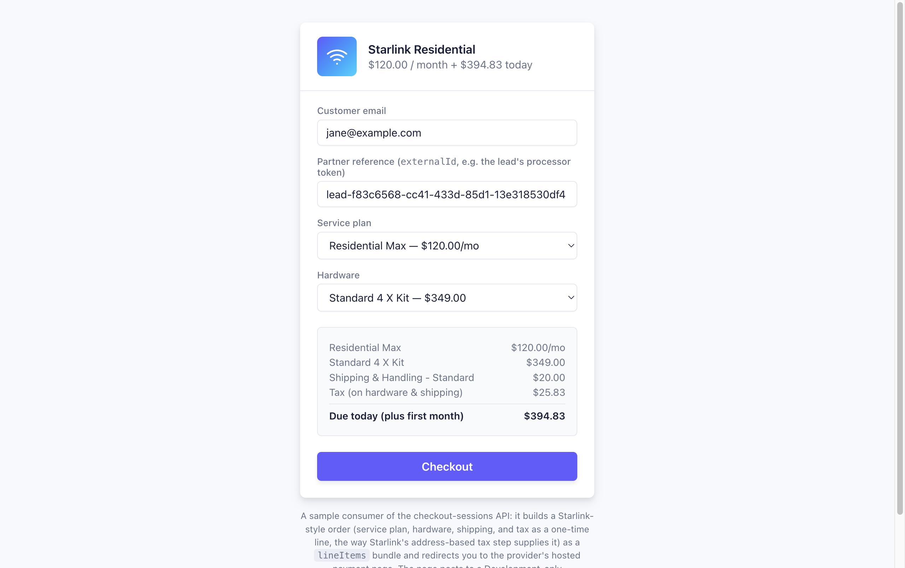
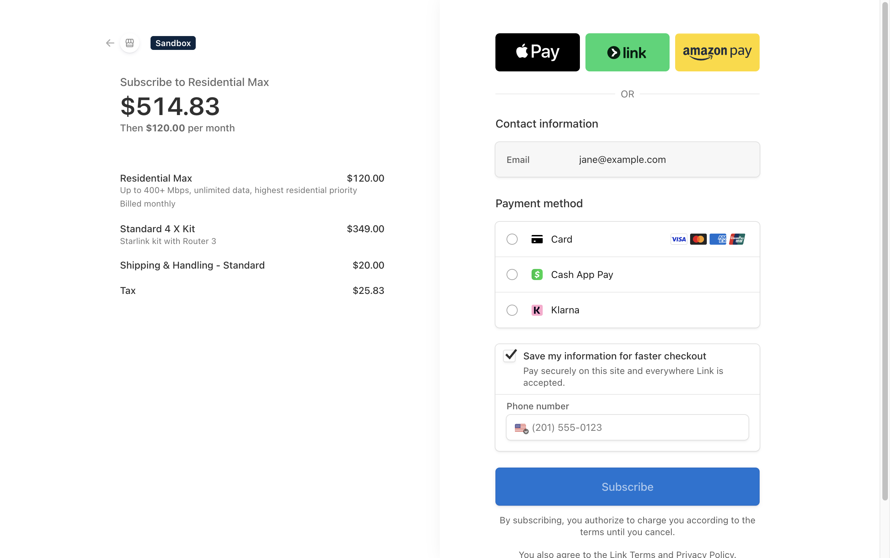
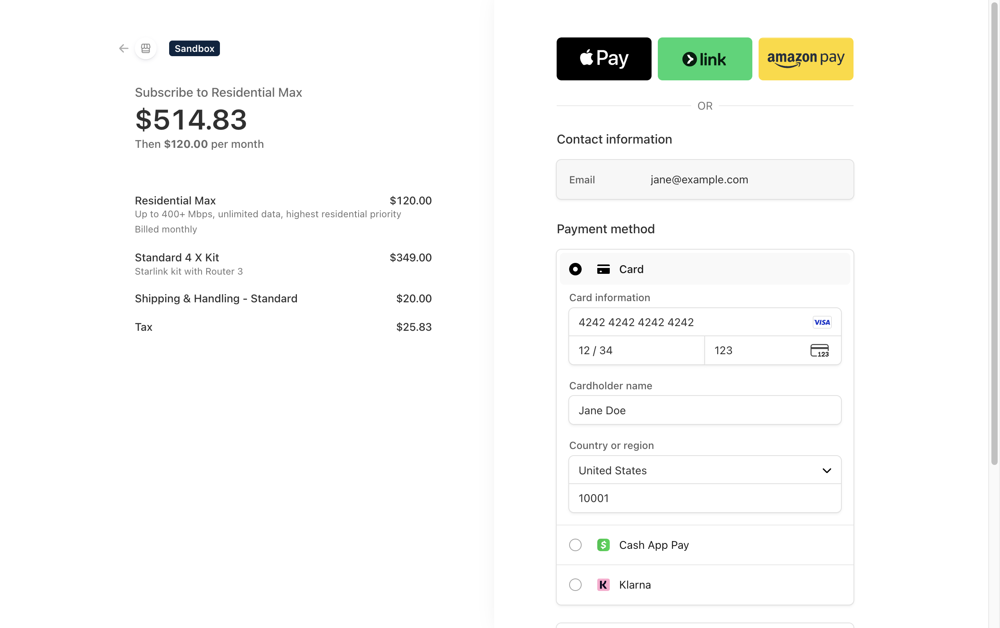
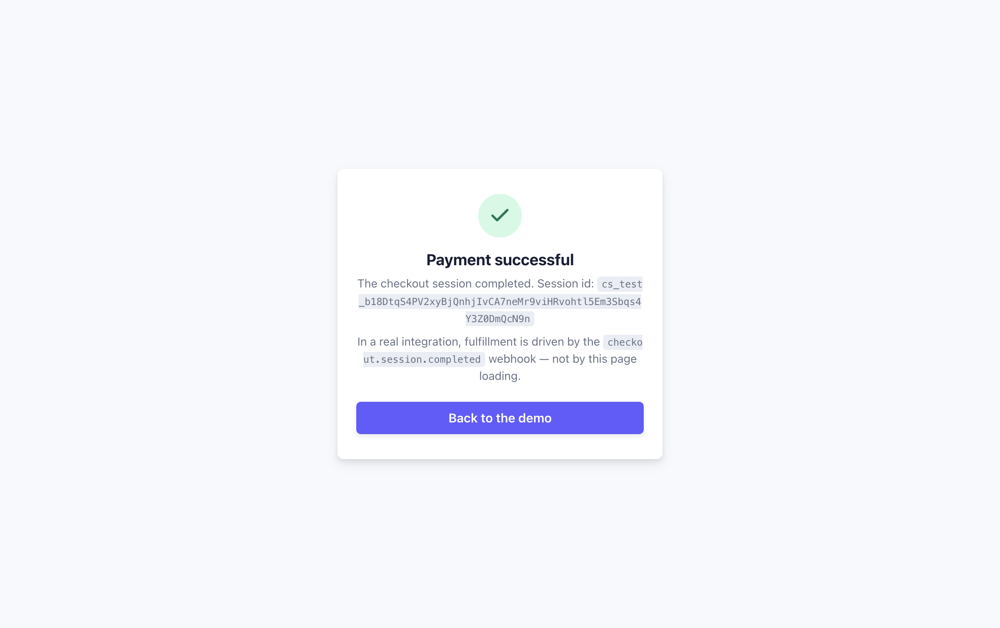
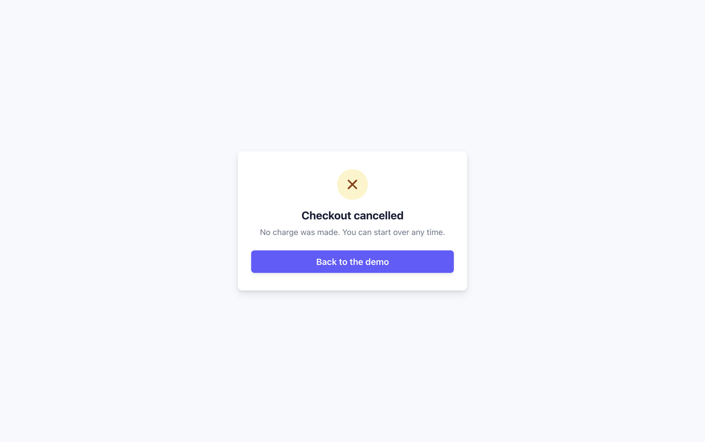

# Demo walkthrough

The repo ships a Development-only demo UI that plays the role of a partner
front end consuming the checkout-sessions API. It builds a Starlink-style
order (service plan + hardware + shipping + tax) as a `lineItems` bundle,
creates a real Stripe Checkout Session, and sends you through the hosted
payment page and back.

The demo only exists when `ASPNETCORE_ENVIRONMENT=Development`; in any other
environment the pages and the `/demo/checkout-sessions` endpoint return 404.

## Prerequisites

- A working local setup — run `/onboard` if you haven't, including step 3
  (a Stripe **test** secret key in user-secrets). Without it, clicking
  Checkout fails with a gateway error.
- The API running locally:

  ```bash
  dotnet run --project src/Checkout.Api
  ```

## 1. Build an order

Open <https://localhost:7210/>. The page is pre-filled with a sample customer
email and a partner reference (`externalId`); pick a service plan and
hardware option. The summary recomputes as you change selections — note that
tax is shown as its own one-time line (caller-computed, the way Starlink's
address-based tax step supplies it), and the recurring plan price is added on
top of the one-time charges in "Due today".



Clicking **Checkout** posts the order to `/demo/checkout-sessions`, a
Development-only stand-in for the partner backend. That endpoint attaches the
API key server-side and calls the real `POST /api/checkout-sessions` — the
key never reaches the browser.

## 2. Pay on Stripe's hosted page

The browser is redirected to the `checkoutUrl` returned by the API. Stripe
renders the full bundle: the subscription line ("Billed monthly", with the
recurring price repeated under "Then $X per month"), the one-time hardware,
shipping, and tax lines, and the combined total due today.



In test mode (note the **Sandbox** badge) you can pay with Stripe's test
card: number `4242 4242 4242 4242`, any future expiry, any CVC, any ZIP.



## 3. Success

After the test payment, Stripe redirects to the demo's `successUrl`
(`success.html`), which displays the `session_id` it was handed via the
`{CHECKOUT_SESSION_ID}` placeholder. As the page itself points out, a real
integration must fulfill from the `checkout.session.completed` webhook, not
from this redirect — the customer may never return to the success page.



You can verify the session, customer, and subscription in the
[Stripe test dashboard](https://dashboard.stripe.com/test/payments).

## 4. Cancel

Backing out of the Stripe page (the **Back** arrow) lands on the `cancelUrl`
(`cancel.html`). Nothing is charged; the session simply expires.


